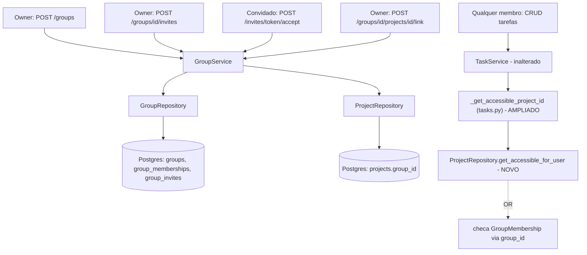

# Groups & RBAC Design

**Spec**: `.specs/features/groups-rbac/spec.md`
**Status**: Approved (arquitetura confirmada com o usuário — abordagem A)

---

## Architecture Overview

Extensão puramente aditiva sobre o v1: nenhum comportamento existente de
`ProjectService`/`TaskService`/`AttachmentService` muda. Um novo domínio
(`Group`/`GroupMembership`/`GroupInvite`) é adicionado, e `Project` ganha um
FK opcional (`group_id`) que amplia — nunca substitui — o `user_id` que já
existe.



---

## Code Reuse Analysis

### Existing Components to Leverage

| Component | Location | How to Use |
| --- | --- | --- |
| `BaseRepository[Model]` | `app/repositories/base.py` | `GroupRepository`/`GroupInviteRepository` herdam `get_by_id`/`delete`, igual aos outros 6 repositories (AD-014). |
| Padrão de token opaco (refresh token) | `app/services/auth_service.py:118-126` | `secrets.token_urlsafe(32)` + `hashlib.sha256(...).hexdigest()` — mesmo esquema pro token de convite. Ver "Tech Decisions" abaixo — extraído pra `core/security.py` em vez de duplicado. |
| Padrão de exceção de domínio + mapeamento no router | `app/services/project_service.py`, `app/api/routers/projects.py` | Mesmo padrão para `GroupNotFoundError`, `NotGroupOwnerError`, `InviteExpiredError`, etc. — service levanta, router mapeia pra HTTP. |
| `_get_owned_project_id` (helper único reaproveitado por tasks+attachments) | `app/api/routers/tasks.py:119`, importado por `attachments.py:8` | Único ponto de checagem de acesso a projeto pra tarefas/anexos — será ampliado aqui (ver AD proposto abaixo), sem tocar nos routers individuais de task/attachment. |
| Rate limit em memória compartilhada (dict a nível de módulo injetado no service) | `app/api/routers/auth.py` (`_shared_failed_attempts`) | Mesmo padrão pro rate limit de geração de convite — ver Risks & Concerns (limitação já conhecida e aceita, não uma regressão nova). |
| `ProjectCreateRequest.name` (`Field(min_length=1, max_length=100)`) | `app/api/routers/projects.py:18` | Mesmo limite pro nome do grupo. |

### Integration Points

| System | Integration Method |
| --- | --- |
| `projects` table | Nova coluna `group_id` (nullable FK pra `groups.id`, `ON DELETE RESTRICT` — nunca apaga projeto por acidente ao excluir grupo, reforça a regra 409 do GRP-12 também no nível do banco). |
| `ProjectRepository` | 2 métodos novos/alterados: `get_accessible_for_user` (novo) e `list_for_user` → renomeado `list_accessible_for_user` (query ampliada, único call site atualizado). `get_for_user` (estrito) **não muda** — continua usado só por rename/delete. |
| `app/api/routers/tasks.py::_get_owned_project_id` | Renomeado `_get_accessible_project_id`; passa a chamar `get_accessible_for_user` em vez de `get_for_user`. Único ponto de mudança pra tarefas E anexos herdarem acesso via grupo automaticamente. |
| `app/main.py` | `app.include_router(groups_router)` — mesmo padrão dos outros 4 routers. |
| Alembic | Nova revisão encadeada em cima de `1c6ee173a43c_init` (não edita a migration existente). |

---

## Components

### `Group` / `GroupMembership` / `GroupInvite` (models)

- **Purpose**: Modelo de dados do domínio de colaboração.
- **Location**: `app/models/group.py`
- **Reuses**: Mesmo estilo dos models existentes (`Mapped`/`mapped_column`, UUID PK com `default=uuid.uuid4`, `created_at`/`updated_at` com `func.now()`).

### `GroupRepository`

- **Purpose**: Acesso a dados de `Group`/`GroupMembership` — criação, listagem por usuário, checagem/alteração de papel, contagem de projetos vinculados (pro guard do GRP-12).
- **Location**: `app/repositories/group_repository.py`
- **Interfaces**:
  - `create(name, owner_user_id) -> Group` — cria o grupo e a membership Owner na mesma operação.
  - `get_membership(group_id, user_id) -> GroupMembership | None`
  - `list_members(group_id) -> list[GroupMembership]`
  - `list_for_user(user_id) -> list[tuple[Group, GroupRole]]`
  - `add_member(group_id, user_id, role) -> GroupMembership`
  - `remove_member(group_id, user_id) -> None`
  - `set_role(group_id, user_id, role) -> None` — usado pela transferência de posse (2 chamadas na mesma transação: novo owner, antigo owner vira member).
  - `count_linked_projects(group_id) -> int` — pro guard 409 de exclusão (GRP-12).
- **Dependencies**: `AsyncSession`.
- **Reuses**: `BaseRepository` (`get_by_id`/`delete` do `Group`).

### `GroupInviteRepository`

- **Purpose**: Acesso a dados de convites — mesmíssimo formato de `RefreshTokenRepository`.
- **Location**: `app/repositories/group_invite_repository.py`
- **Interfaces**:
  - `create(group_id, created_by_user_id, token_hash, expires_at) -> GroupInvite`
  - `get_by_hash(token_hash) -> GroupInvite | None`
  - `list_pending(group_id) -> list[GroupInvite]` (não consumido, não revogado, não expirado)
  - `mark_consumed(invite_id) -> None`
  - `mark_revoked(invite_id) -> None`
- **Reuses**: `BaseRepository`; espelha `RefreshTokenRepository` linha a linha.

### `GroupService`

- **Purpose**: Regras de negócio de grupo — criação, papéis, convites, vínculo com projeto, exclusão com guard. Dono da fronteira de transação (repositories só `flush()`, AD-011).
- **Location**: `app/services/group_service.py`
- **Interfaces** (assinatura completa, todas recebendo `acting_user_id` pra checagem de papel):
  - `create(owner_user_id, name) -> Group`
  - `rename(acting_user_id, group_id, name) -> Group`
  - `delete(acting_user_id, group_id) -> None` — levanta `GroupHasProjectsError` se `count_linked_projects > 0` (GRP-12).
  - `list_for_user(user_id) -> list[GroupWithRole]`
  - `list_members(acting_user_id, group_id) -> list[GroupMembership]`
  - `create_invite(acting_user_id, group_id) -> tuple[GroupInvite, str]` — retorna o registro + o token em texto plano (única vez que existe fora do hash).
  - `accept_invite(acting_user_id, token) -> Group`
  - `revoke_invite(acting_user_id, group_id, invite_id) -> None`
  - `list_pending_invites(acting_user_id, group_id) -> list[GroupInvite]`
  - `remove_member(acting_user_id, group_id, target_user_id) -> None`
  - `leave(acting_user_id, group_id) -> None` — levanta `SoleOwnerCannotLeaveError` se `acting_user_id` for o Owner (GRP-08 AC3).
  - `transfer_ownership(acting_user_id, group_id, new_owner_user_id) -> None` — atômico: `set_role` novo owner + `set_role` antigo owner vira member, no mesmo `commit()`.
  - `link_project(acting_user_id, group_id, project_id) -> Project` — verifica: acting_user é Owner do grupo E dono (`user_id`) do projeto E projeto ainda não tem `group_id` setado.
  - `unlink_project(acting_user_id, group_id, project_id) -> Project`
- **Dependencies**: `GroupRepository`, `GroupInviteRepository`, `ProjectRepository` (só pra `link`/`unlink`), rate-limit dict compartilhado (injetado como em `AuthService`).
- **Reuses**: `generate_opaque_token`/`hash_token` extraídos de `core/security.py` (ver Tech Decisions).

### `ProjectRepository` (extensão)

- **Purpose**: 2 métodos novos/alterados — não muda nada do que já existe.
- **Location**: `app/repositories/project_repository.py`
- **Interfaces (adição)**:
  - `get_accessible_for_user(project_id, user_id) -> Project | None` — `WHERE project.user_id = :user_id OR (project.group_id IS NOT NULL AND EXISTS (membership do user_id no project.group_id))`.
  - `list_accessible_for_user(user_id) -> list[Project]` — mesma condição, sem filtro de ID único. Substitui a chamada que `ProjectService.list_for_user` já fazia em `list_for_user` (renomeado).
- **Reuses**: Mesmo estilo de query dos métodos existentes (`select`/`func`).

### `app/api/routers/groups.py`

- **Purpose**: Expõe os 13 endpoints de GRP-01 a GRP-15 (P1+P2+P3).
- **Location**: `app/api/routers/groups.py`
- **Reuses**: Mesmo esqueleto de `projects.py` (Pydantic request/response models, `Depends(get_current_user)`, factory `_get_group_service`, `try/except` mapeando exceção de domínio → `HTTPException`).
- **Rotas** (prefixo `/groups`, mais uma rota solta `/invites/{token}/accept` já que aceitar não pertence a um `group_id` conhecido de antemão):
  - `POST /groups` (GRP-01)
  - `GET /groups` (GRP-14)
  - `PATCH /groups/{group_id}` (GRP-13)
  - `DELETE /groups/{group_id}` (GRP-12)
  - `GET /groups/{group_id}/members` (GRP-06)
  - `DELETE /groups/{group_id}/members/{user_id}` (GRP-07)
  - `POST /groups/{group_id}/leave` (GRP-08)
  - `POST /groups/{group_id}/transfer-ownership` (GRP-09)
  - `POST /groups/{group_id}/invites` (GRP-02)
  - `GET /groups/{group_id}/invites` (GRP-15)
  - `DELETE /groups/{group_id}/invites/{invite_id}` (GRP-10)
  - `POST /invites/{token}/accept` (GRP-03)
  - `POST /groups/{group_id}/projects/{project_id}/link` (GRP-04)
  - `POST /groups/{group_id}/projects/{project_id}/unlink` (GRP-11)

---

## Data Models

```python
class GroupRole(str, enum.Enum):
    OWNER = "owner"
    MEMBER = "member"

class Group(Base):
    __tablename__ = "groups"
    id: UUID (pk)
    name: str(100)
    created_at, updated_at: datetime

class GroupMembership(Base):
    __tablename__ = "group_memberships"
    id: UUID (pk)
    group_id: UUID (FK groups.id, ON DELETE CASCADE, index)
    user_id: UUID (FK users.id, index)
    role: GroupRole
    created_at: datetime
    # UniqueConstraint(group_id, user_id) — não duplica membership
    # Index parcial: UNIQUE(group_id) WHERE role = 'owner'
    #   -> garante exatamente 1 owner por grupo NO BANCO, não só na app

class GroupInvite(Base):
    __tablename__ = "group_invites"
    id: UUID (pk)
    group_id: UUID (FK groups.id, ON DELETE CASCADE, index)
    created_by_user_id: UUID (FK users.id)
    token_hash: str(255, index, unique)  # espelha RefreshToken.token_hash
    expires_at: datetime
    consumed_at: datetime | None  # setado no accept
    revoked_at: datetime | None   # setado no revoke explícito do Owner
    created_at: datetime

# Alteração em Project (app/models/project.py):
class Project(Base):
    ...  # campos existentes inalterados
    group_id: UUID | None (FK groups.id, ON DELETE RESTRICT, index, nullable)
```

**Relationships**:
- `Group 1--N GroupMembership N--1 User` (tabela de junção com papel).
- `Group 1--N GroupInvite`.
- `Group 1--N Project` (via `Project.group_id`, nullable) — confirma a cardinalidade N:1 discutida (um grupo com vários projetos; cada projeto em no máximo um grupo).

---

## Error Handling Strategy

| Error Scenario | Handling | User Impact |
| --- | --- | --- |
| Não-Owner tenta ação de gestão (convidar, remover, transferir, (des)vincular, excluir, renomear) | `NotGroupOwnerError` no service → 403 | "você não tem permissão para esta ação" |
| `group_id` inexistente ou usuário não é membro | `GroupNotFoundError` → 404 (mesmo padrão de ocultação do AD-012/ISO-02) | "grupo não encontrado" |
| Token de convite já consumido | `InviteAlreadyUsedError` → 409 | "convite já utilizado" |
| Token de convite expirado (>7 dias) | `InviteExpiredError` → 410 | "convite expirado" |
| Token de convite inválido/revogado | `InviteNotFoundError` → 404 (mesmo tratamento pra revogado e inexistente — não vaza qual dos dois) | "convite não encontrado" |
| Usuário já é membro tentando aceitar de novo | `AlreadyMemberError` → 409 | "você já é membro deste grupo" |
| Vincular projeto que não é seu | `ProjectNotFoundError` (reaproveitada do v1) → 404 | mesmo padrão já existente |
| Vincular projeto já vinculado a outro grupo | `ProjectAlreadyLinkedError` → 409 | "projeto já pertence a outro grupo" |
| Excluir grupo com projeto(s) ainda vinculado(s) | `GroupHasProjectsError` → 409 | "desvincule os projetos antes de excluir o grupo" |
| Owner tenta sair sem transferir posse | `SoleOwnerCannotLeaveError` → 409 | "transfira a posse do grupo antes de sair" |
| Transferir posse pra alguém que não é membro | `NotGroupMemberError` → 404/422 | "usuário não é membro deste grupo" |
| >10 convites gerados em 1h pelo mesmo Owner/grupo | `InviteRateLimitExceededError` → 429 | "muitos convites gerados, tente novamente mais tarde" |

---

## Risks & Concerns

| Concern | Location | Impact | Mitigation |
| --- | --- | --- | --- |
| Rate limit de convite em memória (dict a nível de módulo, igual ao rate limit de login já existente) | `app/api/routers/auth.py` (`_shared_failed_attempts`, padrão a ser replicado em `groups.py`) | Não sobrevive a restart do processo nem funciona corretamente com múltiplas réplicas da API | Limitação já aceita no v1 (mesmo padrão, mesmo trade-off) — consistente com a topologia atual de instância única (AD-015 já documenta essa mesma premissa pra migrations). Não é uma regressão nova desta feature; resolver de verdade (Redis compartilhado) é item de v3/infra. |
| `ProjectRepository.list_for_user` renomeado pra `list_accessible_for_user` e sua query muda de "só o que possuo" pra "o que possuo OU acesso via grupo" | `app/repositories/project_repository.py`, único call site em `ProjectService.list_for_user` | Baixo — só 1 call site, mapeado acima; mas é uma mudança de comportamento observável em `GET /projects` (agora pode incluir projetos de grupo) | Coberto explicitamente pelos ACs do GRP-04/P1 — é o comportamento pedido pela spec, não um efeito colateral acidental. Testes de regressão do v1 (usuário sem grupo nenhum) continuam cobrindo o caso antigo (query com `group_id IS NULL` se reduz à condição original). |
| Duplicação de lógica de token opaco (`secrets.token_urlsafe` + sha256) entre `AuthService` e o novo fluxo de convite | `app/services/auth_service.py:118-126` | Duplicação real se não for extraída agora | Extraída pra `app/core/security.py` (`generate_opaque_token`/`hash_token`) nesta própria feature — `AuthService` é refatorado pra usar as mesmas funções (mesmo espírito da extração de `BaseRepository`, AD-014). |
| `_get_owned_project_id` renomeado — usado por 2 routers (`tasks.py` interno + `attachments.py` via import) | `app/api/routers/tasks.py:119`, `app/api/routers/attachments.py:8` | Renomear sem atualizar o import quebra o import silenciosamente até rodar os testes | Ambos os arquivos atualizados na mesma task/commit — coberto pelos testes de integração existentes de tasks/attachments (já rodam a cada task por causa do gate). |

> Nenhum risco de segurança novo identificado além dos já mitigados acima — o modelo de acesso permanece estritamente aditivo (nunca reduz o que o v1 já protegia).

---

## Tech Decisions

| Decision | Choice | Rationale |
| --- | --- | --- |
| Ownership do grupo | Derivada de `GroupMembership.role`, sem coluna `owner_user_id` redundante em `Group` | Índice único parcial (`UNIQUE(group_id) WHERE role='owner'`) garante "exatamente 1 owner" **no banco**, não só na aplicação — mais forte que checar isso só em `GroupService`. |
| Extração de `generate_opaque_token`/`hash_token` pra `core/security.py` | Sim, e `AuthService` é refatorado pra usar as mesmas funções | Evita duplicar a lógica de token entre refresh token (v1) e convite de grupo (v2) — mesmo racional da extração de `BaseRepository` (AD-014). Vira candidato a novo AD (ver abaixo). |
| `Project.group_id` com `ON DELETE RESTRICT` | Em vez de `CASCADE` ou `SET NULL` | Reforça a regra de negócio (409 ao excluir grupo com projeto vinculado, GRP-12) também no nível do banco — defesa em profundidade, não só checagem na service layer. |
| Rota de aceitar convite fora do prefixo `/groups/{id}` | `POST /invites/{token}/accept` | Quem aceita não conhece o `group_id` de antemão (só tem o token) — forçar `/groups/{id}/invites/{token}/accept` obrigaria o cliente a decodificar o grupo do token antes de chamar, inversão de responsabilidade. |

> **Candidato a novo AD** (será registrado em `.specs/STATE.md` no fechamento do Design, junto com a confirmação do usuário): "Autorização de projeto ampliada via grupo é aditiva — `get_for_user`/`list_for_user` estritos continuam existindo pra rename/delete; `get_accessible_for_user`/`list_accessible_for_user` novos cobrem leitura/tarefas/listagem. Nenhum endpoint de v1 muda de comportamento pra quem nunca usa grupos."
