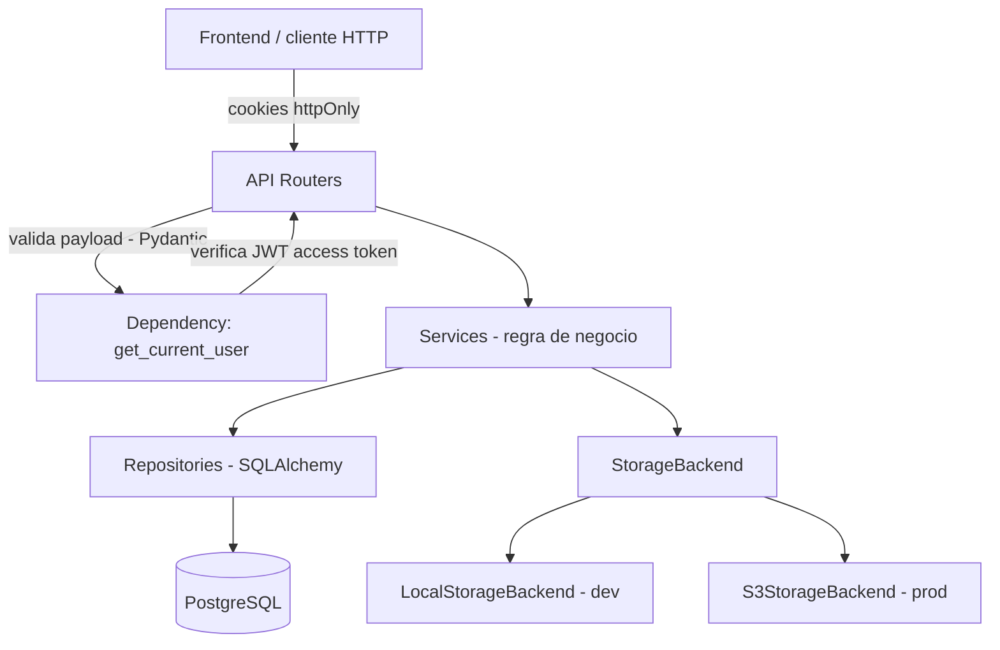
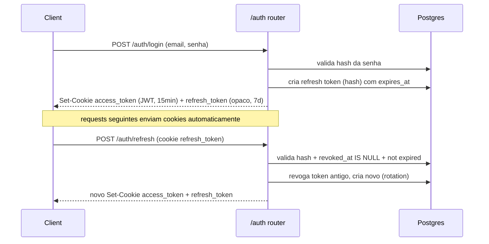

# Taskly API Design

**Spec**: `.specs/features/taskly-api/spec.md`
**Status**: Approved

---

## Architecture Overview

Arquitetura em camadas (layered), escolhida entre 3 opções apresentadas ao usuário (layered / SQLModel / fat routes) — ver `AD-005` em `STATE.md`. Cada requisição HTTP passa por: router (validação de entrada via Pydantic + extração do usuário autenticado) → service (regra de negócio, ex.: bloqueio de delete de projeto com tarefas, transições de status livres) → repository (única camada que fala SQL/SQLAlchemy) → Postgres.



**Fluxo de autenticação:**



---

## Code Reuse Analysis

Projeto greenfield — sem código existente. Nenhuma análise de reuso aplicável nesta primeira feature; entradas futuras aqui quando houver uma segunda feature reaproveitando estas camadas.

### Integration Points

| System | Integration Method |
| --- | --- |
| PostgreSQL | SQLAlchemy 2.0 (async, driver `asyncpg`) via repositories; schema versionado com Alembic |
| Storage (anexos) | Interface `StorageBackend` (protocolo Python); implementações `LocalStorageBackend` (dev) e `S3StorageBackend` (prod, via `boto3`), selecionadas por env var `STORAGE_BACKEND` |
| Frontend (`taskly-ui`) | Contrato REST/JSON documentado via OpenAPI (gerado automaticamente pelo FastAPI em `/docs`); autenticação via cookies httpOnly, CORS com `credentials: true` restrito à origem do frontend |

---

## Components

### `api/routers/auth.py`

- **Purpose**: Endpoints de registro, login, refresh e logout.
- **Location**: `app/api/routers/auth.py`
- **Interfaces**:
  - `POST /auth/register(email, password) -> 201`
  - `POST /auth/login(email, password) -> 200, Set-Cookie`
  - `POST /auth/refresh() -> 200, Set-Cookie` (lê cookie `refresh_token`)
  - `POST /auth/logout() -> 204` (revoga refresh token, limpa cookies)
- **Dependencies**: `AuthService`
- **Reuses**: n/a (greenfield)

### `services/auth_service.py`

- **Purpose**: Regras de autenticação — hashing, emissão/validação de JWT, rotação de refresh token, rate limiting de login.
- **Location**: `app/services/auth_service.py`
- **Interfaces**:
  - `register(email: str, password: str) -> User`
  - `authenticate(email: str, password: str) -> TokenPair`
  - `refresh(refresh_token: str) -> TokenPair`
  - `logout(refresh_token: str) -> None`
- **Dependencies**: `UserRepository`, `RefreshTokenRepository`, `PasswordHasher`, `JWTService`, rate limiter (`slowapi`)
- **Reuses**: n/a

### `core/security.py`

- **Purpose**: `PasswordHasher` (bcrypt via `passlib`) e `JWTService` (encode/decode access token via `PyJWT`), utilitários puros sem I/O de banco.
- **Location**: `app/core/security.py`
- **Interfaces**:
  - `PasswordHasher.hash(plain: str) -> str`
  - `PasswordHasher.verify(plain: str, hashed: str) -> bool`
  - `JWTService.encode(user_id: UUID, ttl: timedelta) -> str`
  - `JWTService.decode(token: str) -> UUID` (levanta exceção se inválido/expirado)
- **Dependencies**: nenhuma (funções puras, fáceis de testar isoladamente)

### `api/dependencies.py`

- **Purpose**: Dependency `get_current_user` usada por todos os routers protegidos; extrai o cookie `access_token`, valida via `JWTService`, carrega o usuário.
- **Location**: `app/api/dependencies.py`
- **Interfaces**:
  - `get_current_user(request: Request) -> User` (levanta `HTTPException(401)` se ausente/inválido)
- **Dependencies**: `JWTService`, `UserRepository`

### `api/routers/projects.py` + `services/project_service.py` + `repositories/project_repository.py`

- **Purpose**: CRUD de projetos com checagem de ownership.
- **Location**: `app/api/routers/projects.py`, `app/services/project_service.py`, `app/repositories/project_repository.py`
- **Interfaces**:
  - `create(user_id, name) -> Project`
  - `list_for_user(user_id) -> list[Project]`
  - `rename(user_id, project_id, name) -> Project` (404 se não pertence ao usuário)
  - `delete(user_id, project_id) -> None` (409 se houver tarefas — checagem no service antes de chamar o repository)

### `api/routers/tasks.py` + `services/task_service.py` + `repositories/task_repository.py`

- **Purpose**: CRUD de tarefas, validação de tags, transições de status.
- **Location**: `app/api/routers/tasks.py`, `app/services/task_service.py`, `app/repositories/task_repository.py`
- **Interfaces**:
  - `create(user_id, project_id, title, ...) -> Task` (404 se projeto não pertence ao usuário)
  - `list_for_project(user_id, project_id) -> list[Task]`
  - `update(user_id, task_id, patch) -> Task` (aceita qualquer subconjunto de campos, incluindo `status`; nenhuma validação de ordem de transição — STAT-01)
  - `delete(user_id, task_id) -> None` (remove anexos associados via `AttachmentService` antes)

### `api/routers/attachments.py` + `services/attachment_service.py`

- **Purpose**: Upload/remoção de anexos, delegando persistência ao `StorageBackend`.
- **Location**: `app/api/routers/attachments.py`, `app/services/attachment_service.py`
- **Interfaces**:
  - `upload(user_id, task_id, file: UploadFile) -> Attachment` (valida tamanho ≤10MB antes de chamar o storage; 413 se exceder)
  - `delete(user_id, task_id, attachment_id) -> None`

### `Dockerfile` (multi-stage)

- **Purpose**: Build de produção mínimo e hardened.
- **Location**: `Dockerfile` (raiz do repo)
- **Estrutura**:
  - **Stage `builder`**: imagem `python:3.12-slim` + `uv` instalado, roda `uv sync --locked --no-dev` para materializar o virtualenv (`.venv`) a partir do `uv.lock` — nenhuma ferramenta de build fica na imagem final.
  - **Stage `runtime`**: imagem `python:3.12-slim` limpa, copia **apenas** `.venv` e o código da aplicação (`app/`) do stage `builder` — sem `uv`, sem cache de instalação, sem toolchain de compilação.
  - Cria um usuário/grupo de aplicação dedicado (`appuser`, uid/gid não-root) via `RUN adduser`, faz `chown` do código e do diretório de anexos locais (`/app/data/attachments`) para esse usuário, e troca para ele com `USER appuser` antes do `CMD`. O restante do filesystem da imagem (código-fonte, `site-packages`) não é gravável pelo processo em runtime.
- **Dependencies**: `docker-compose.yml` (dev) expõe a mesma imagem com volume de dev; produção usa a imagem multi-stage diretamente.
- **Reuses**: `uv.lock` (T1) como fonte determinística de dependências para o stage `builder`.

### `storage/backend.py`

- **Purpose**: Abstração de storage de anexos.
- **Location**: `app/storage/backend.py` (protocolo) + `app/storage/local.py` + `app/storage/s3.py`
- **Interfaces**:
  - `StorageBackend.save(key: str, content: bytes, content_type: str) -> str` (retorna URL/referência)
  - `StorageBackend.delete(key: str) -> None`
- **Dependencies**: `LocalStorageBackend` grava em `./data/attachments/` (dev); `S3StorageBackend` usa `boto3` (prod), bucket/credenciais via env vars

---

## Data Models

### User

```python
class User:
    id: UUID
    email: str          # unique, indexed
    password_hash: str
    created_at: datetime
```

### RefreshToken

```python
class RefreshToken:
    id: UUID
    user_id: UUID        # FK -> User
    token_hash: str       # hash do token opaco (nunca armazenar em texto plano)
    expires_at: datetime
    revoked_at: datetime | None
    created_at: datetime
```

**Relationships**: `User 1—N RefreshToken`. Rotação: cada `/auth/refresh` revoga o token usado e cria um novo — se um token revogado for reutilizado, é sinal de possível roubo (detecção simples, sem ação automática além de negar).

### Project

```python
class Project:
    id: UUID
    user_id: UUID        # FK -> User
    name: str             # 1-100 chars
    created_at: datetime
    updated_at: datetime
```

**Relationships**: `User 1—N Project`. Delete bloqueado (409) se `Project 1—N Task` não estiver vazio (PROJ-04).

### Task

```python
class TaskStatus(str, Enum):
    NOT_STARTED = "not_started"
    IN_PROGRESS = "in_progress"
    DONE = "done"
    CANCELLED = "cancelled"

class Task:
    id: UUID
    project_id: UUID              # FK -> Project
    title: str                     # 1-200 chars, único campo obrigatório
    short_description: str | None
    full_description: str | None
    due_at: datetime | None
    tags: list[str]                 # Postgres ARRAY(String(20))
    status: TaskStatus              # default NOT_STARTED
    created_at: datetime
    updated_at: datetime
```

**Relationships**: `Project 1—N Task`. `Task 1—N Attachment` (cascade delete).

### Attachment

```python
class Attachment:
    id: UUID
    task_id: UUID          # FK -> Task
    filename: str
    storage_key: str        # caminho/chave no backend de storage
    content_type: str
    size_bytes: int
    created_at: datetime
```

---

## Error Handling Strategy

| Error Scenario | Handling | User Impact |
| --- | --- | --- |
| Sessão ausente/inválida em rota protegida | `get_current_user` levanta `HTTPException(401)` | Frontend intercepta 401 globalmente e redireciona pra login |
| Acesso a recurso de outro usuário | Service filtra por `user_id` na query; não encontrado → `HTTPException(404)` | Nunca revela que o recurso existe |
| E-mail duplicado no registro | `IntegrityError` da constraint única capturada no service → `HTTPException(409)` | Mensagem "e-mail já cadastrado" |
| Delete de projeto com tarefas | Service checa `COUNT(tasks) > 0` antes do delete → `HTTPException(409)` | Mensagem "remova as tarefas antes de excluir o projeto" |
| Falha no storage ao subir anexo | `StorageBackend` levanta exceção própria → capturada no router → `HTTPException(502)` | Tarefa e demais campos já salvos permanecem intactos; apenas o anexo falha |
| Rate limit de login excedido | `slowapi` intercepta antes do handler → `429` | Mensagem genérica de "muitas tentativas, tente novamente em alguns minutos" |
| Payload inválido (Pydantic) | Validação automática do FastAPI → `422` | Corpo de erro padrão do FastAPI com o campo inválido |

---

## Risks & Concerns

| Concern | Location (file:line) | Impact | Mitigation |
| --- | --- | --- | --- |
| CSRF em requests que mudam estado (cookies são enviados automaticamente pelo browser) | `app/api/dependencies.py` (a criar) | Um site malicioso poderia disparar um POST/PATCH autenticado sem o usuário perceber | Cookies com `SameSite=Lax` (padrão) já bloqueiam a maior parte dos casos cross-site; se o deploy final colocar frontend e API em domínios totalmente diferentes (não subdomínios do mesmo site), reavaliar para `SameSite=None + Secure` e adicionar verificação de `Origin`/`Referer` nas mutações — tarefa a criar no Design→Tasks se a topologia de deploy mudar |
| Segredo do JWT (`JWT_SECRET`) e credenciais do banco/S3 em variáveis de ambiente | `app/core/config.py` (a criar) | Vazamento de segredo compromete toda a autenticação | `.env` no `.gitignore`, `.env.example` versionado sem valores reais, documentado no README |
| Rate limiter em memória (`slowapi` sem backend Redis) | `app/services/auth_service.py` (a criar) | Não funciona corretamente se a API rodar em múltiplas instâncias (cada instância tem seu próprio contador) | Aceitável para o escopo do case (deploy de instância única); documentar a limitação no README como próximo passo de produção |
| `LocalStorageBackend` grava em disco local | `app/storage/local.py` (a criar) | Anexos somem se o container for recriado sem volume persistente | Aceitável em dev; documentar que produção usa S3 (já decidido) |
| Container rodando como root em runtime | `Dockerfile` (a criar) | Se o processo for comprometido, ganha permissão de escrita em todo o filesystem da imagem (inclusive o próprio código da app) | Multi-stage build com `USER appuser` não-root no stage final; `chown` restrito só ao código e à pasta de anexos locais — o restante do filesystem fica read-only para o processo |
| Dependência comprometida (supply-chain attack — pacote PyPI malicioso publicado sob nome legítimo ou typosquat) | `pyproject.toml` / `uv.lock` (a criar) | Código malicioso executado em dev/CI/prod via uma dependência transitiva | Versões fixadas (sem `^`/`~`), `uv.lock` versionado e instalado com `uv sync --locked` (nunca resolve versões novas silenciosamente); `uv run pip-audit` como parte da task de setup/CI; qualquer nova dependência revisada manualmente antes de adicionada (nome, mantenedor, downloads) — vale também para libs sugeridas por IA |

> Nenhum risco bloqueante para iniciar a implementação — todos têm mitigação definida ou são aceitáveis dentro do escopo do case.

---

## Tech Decisions (only non-obvious ones)

| Decision | Choice | Rationale |
| --- | --- | --- |
| Arquitetura | Layered (routers → services → repositories) | Escolhida pelo usuário entre 3 opções; melhor equilíbrio entre separação de responsabilidades (critério de avaliação) e velocidade para um case de 3 dias |
| ORM | SQLAlchemy 2.0 async + `asyncpg` | Combina com o modelo assíncrono do FastAPI; maduro; schemas Pydantic ficam separados dos modelos ORM (reforça a camada) |
| Migrations | Alembic | Padrão de fato com SQLAlchemy; migrations versionadas em git dão rastreabilidade das mudanças de schema |
| Hash de senha | `passlib[bcrypt]` | Padrão consolidado, simples de usar corretamente |
| JWT | `PyJWT` | Biblioteca ativa e simples para encode/decode de access token |
| Refresh token | Persistido no banco (hash), com rotação a cada refresh | Permite logout/revogação real (JWT stateless puro não permite invalidar antes de expirar) |
| Tags | Coluna `ARRAY(String(20))` na própria tabela `tasks`, sem tabela `tags` separada | Tags são texto livre por tarefa; não há requisito de listar/reusar tags entre tarefas no escopo do case |
| Rate limiting | `slowapi` em memória | Dependência mínima suficiente para o escopo (instância única); ver limitação em Risks & Concerns |
| Testes de integração | `pytest` + `pytest-asyncio` + `httpx.AsyncClient` contra Postgres real (docker-compose de teste) | Postgres é requisito obrigatório da vaga; testar contra SQLite mascararia diferenças de tipos (ex.: `ARRAY`) |
| Testes unitários | `pytest` puro para `core/security.py` (hash, JWT) e regras de service que não dependem de I/O (ex.: validação de tag >20 chars) | Rápidos, sem precisar subir Postgres; complementam os testes de integração por camada |
| Gerenciador de pacotes | `uv` (Astral) — `pyproject.toml` + `uv.lock` | Pedido explícito do usuário; lockfile determinístico, resolução rápida, substitui pip+venv+pip-tools por uma ferramenta só |
| Segurança de dependências | Versões fixadas (sem `^`/`~`) no `pyproject.toml`, `uv.lock` versionado, instalação sempre via `uv sync --locked`, `uv run pip-audit` rodado na task de setup e documentado como passo de CI | Mitiga risco de supply-chain attack (pacotes PyPI comprometidos) — pedido explícito do usuário; ver `Risks & Concerns` |
| Documentação de API | OpenAPI/Swagger gerado automaticamente pelo FastAPI, exposto em `/docs` (Swagger UI) e `/redoc`, sem documentação manual paralela | Zero custo de manutenção — sempre reflete os routers/schemas Pydantic reais; atende diretamente o critério de avaliação de documentação do case |
| Containerização | `Dockerfile` multi-stage (`builder` com `uv sync` → `runtime` slim só com `.venv` + código), usuário não-root (`appuser`) no stage final, `chown` restrito ao código e à pasta de anexos | Pedido explícito do usuário — imagem final menor (sem toolchain de build) e hardening básico (processo comprometido não ganha escrita no filesystem da imagem) |

> **Project-level decisions:** arquitetura, ORM/migrations, persistência de refresh token, gerenciador de pacotes, prática de segurança de dependências e estratégia de containerização afetam qualquer feature futura neste backend — registradas como `AD-005` a `AD-010` em `STATE.md`.
